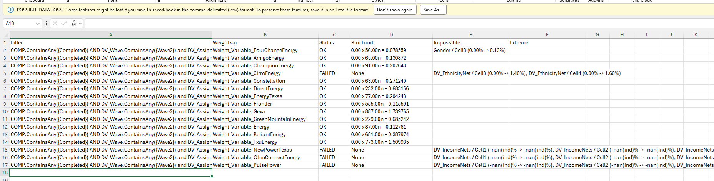

# Wgt-Report-Summary
The tool designed to give a summary of what happened in weighting, in one file.

This could potentially save you a ton of time. See all on screenshot - you see cells, variables, you don't have to look checking each stupid number in report, and you see an aggregated summary of which groups failed and need adjusting.

So, just run and enjoy. Distribution includes the bat file, so just open and and adjust the path to your file. There is a "pause" statement at the end. That's it.

See details on the screenshot.

